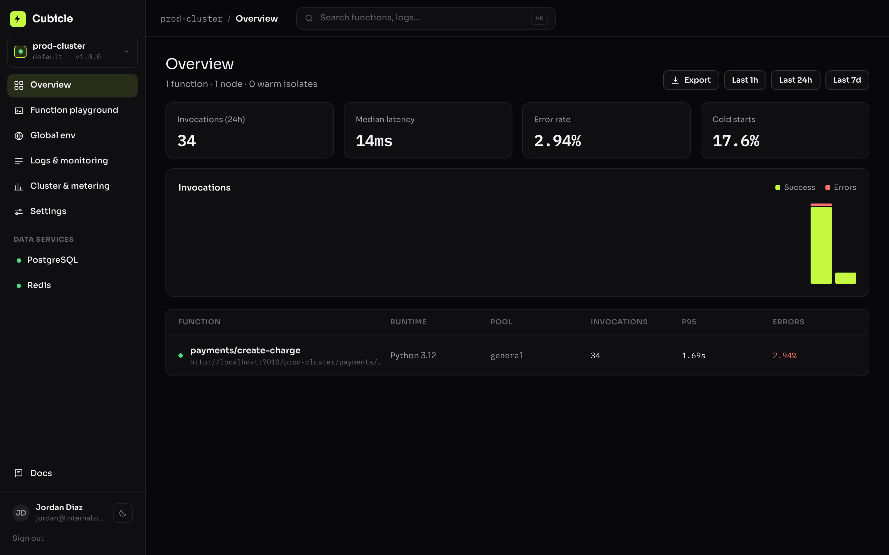
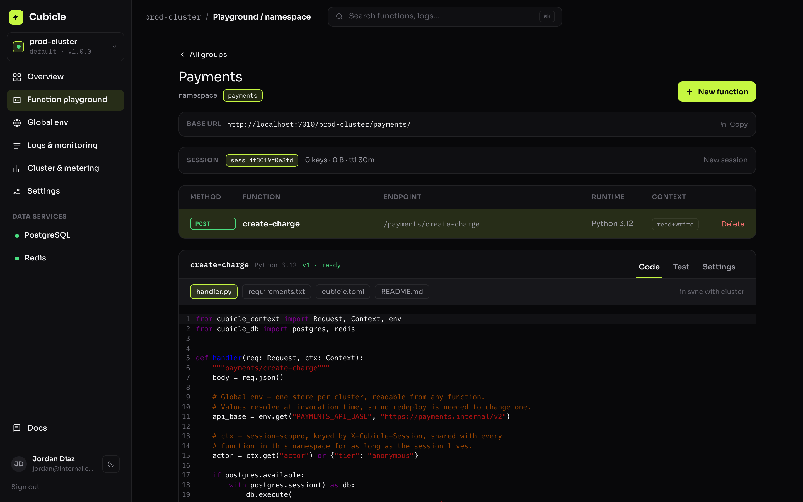
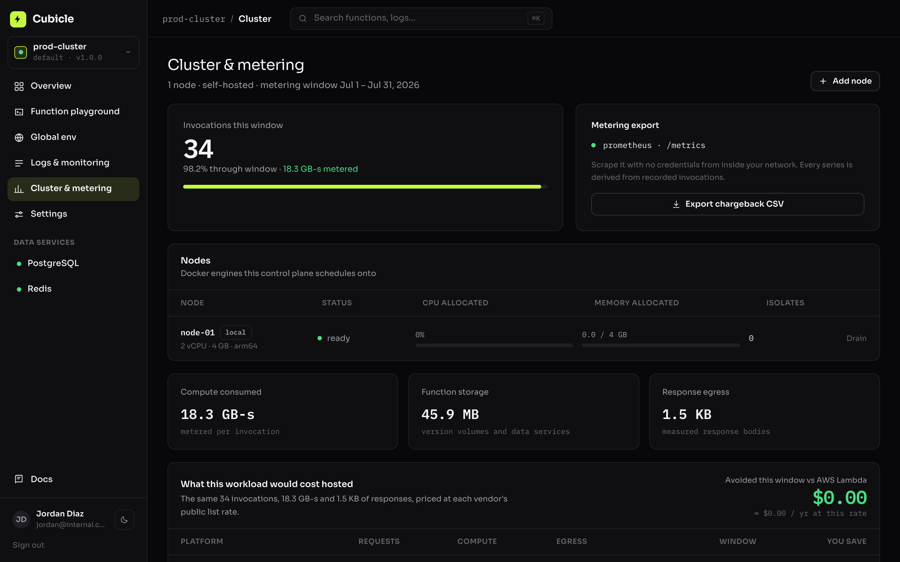
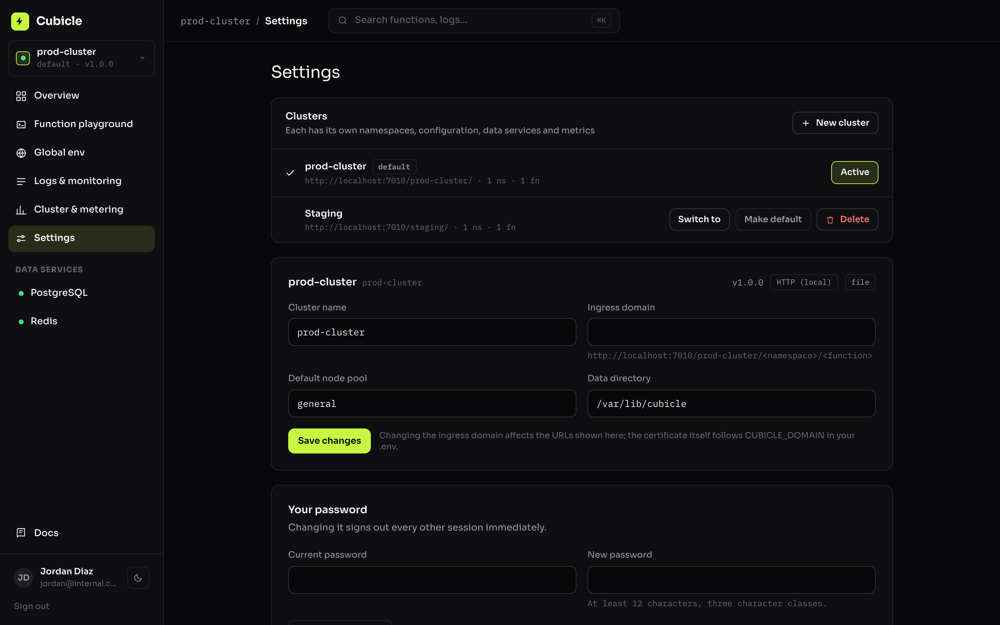
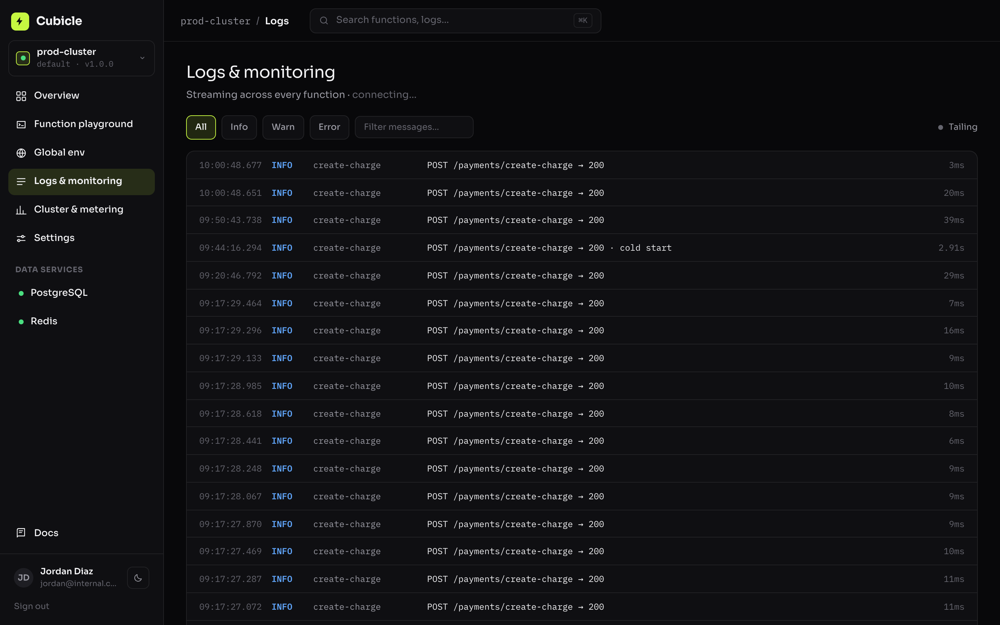
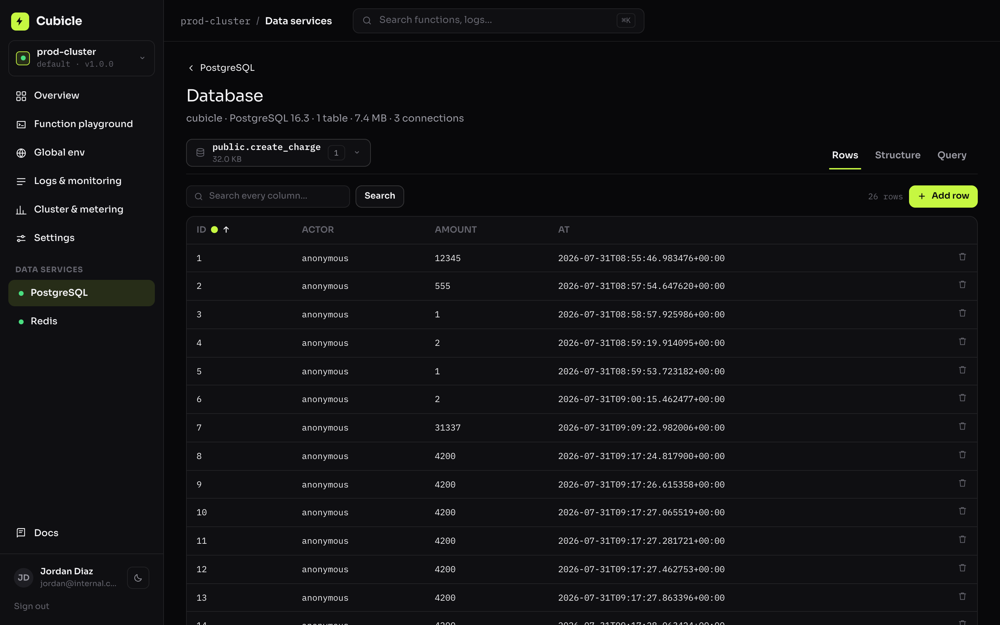
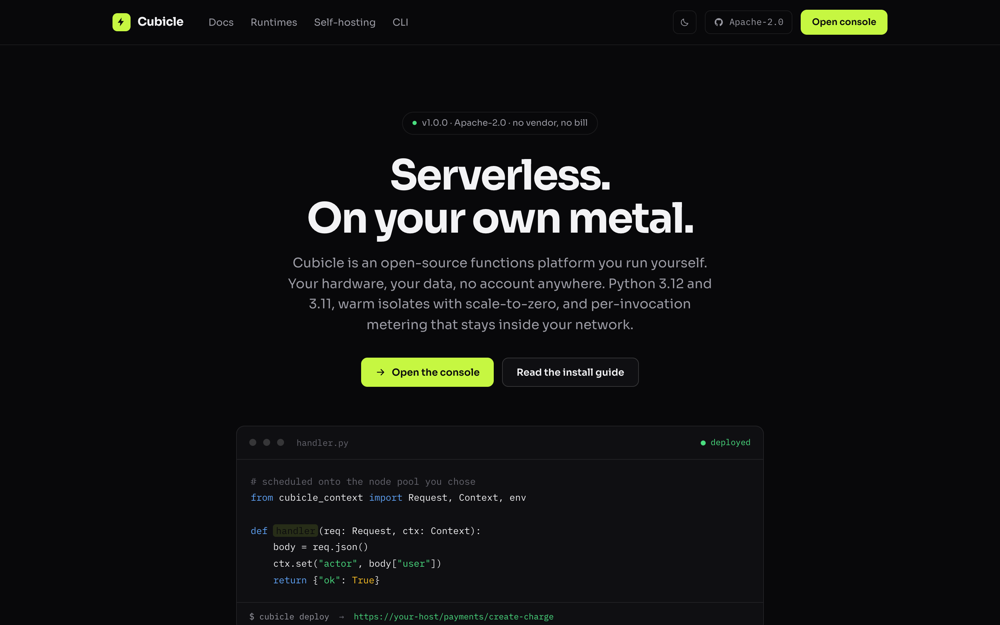
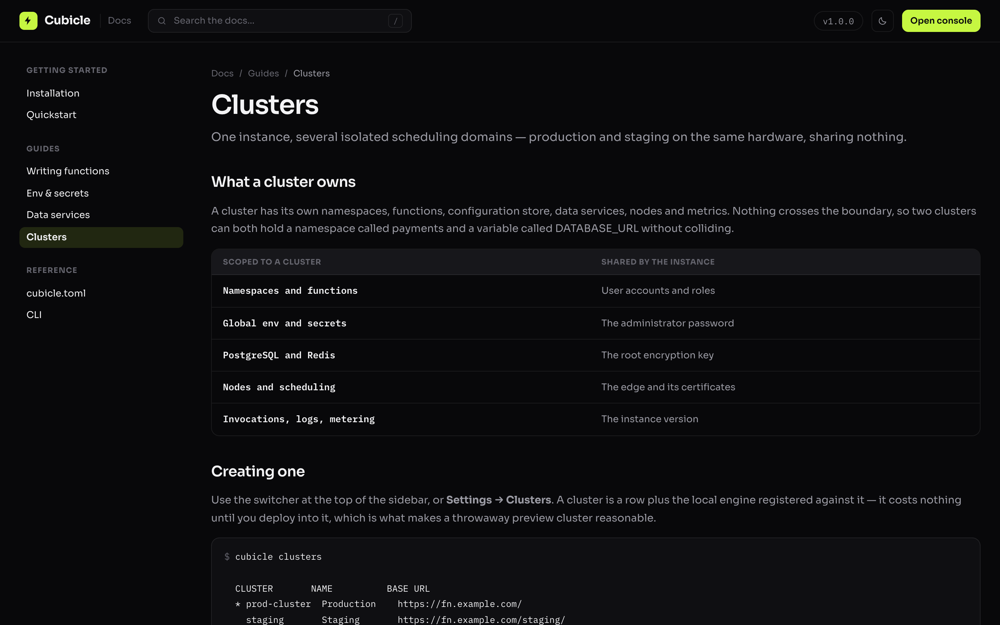

<div align="center">

# Cubicle

**Serverless. On your own metal.**

An open-source functions platform you run yourself. Your hardware, your data,
no account anywhere. One command to install, automatic HTTPS when you point a
domain at it, and nothing that calls home.

Apache-2.0 · Python 3.12 and 3.11 runtimes · entirely Docker-based



</div>

---

## Install

```bash
git clone https://github.com/clickTwice26/cubicle && cd cubicle
./install.sh
```

That builds the images, generates every secret, starts the stack and prints the
console URL — `http://localhost:28080` by default, or the next free port if
something already holds it. Open it and the first screen
is setup, where you name the cluster and choose the administrator password.
**There is no registration anywhere in the product**; that password is the only
credential the instance has.

### With a domain

Point an A/AAAA record at the machine and pass the hostname:

```bash
./install.sh --domain fn.example.com --email ops@example.com
```

Caddy obtains and renews a Let's Encrypt certificate on the first request. The
installer publishes ports 80 and 443 in this mode so the ACME HTTP-01 challenge
resolves. Add `--staging` while you are testing so a DNS mistake does not spend
the production rate limit.

Re-running `install.sh` is safe: an existing `.env` is reused and secrets are
never rotated.

---

## What you get

| Screen | What it actually does |
| --- | --- |
| **Clusters** | Several isolated scheduling domains on one instance — production and staging sharing hardware but nothing else. Switch from the sidebar |
| **Overview** | KPIs, invocation histogram and per-function latency — all computed from recorded invocations, never sampled |
| **Function playground** | Namespaces, a real code editor, immutable versioned deploys, and a test console that runs the function on the cluster |
| **Global env** | One configuration store per cluster, resolved at invocation time so a change needs no redeploy |
| **Logs & monitoring** | Handler stdout/stderr and control-plane events, streamed live over SSE |
| **Cluster & metering** | Node capacity and allocation, GB-seconds, measured egress, chargeback by namespace, and a cost comparison against public list prices |
| **PostgreSQL / Redis** | Real instances provisioned on the cluster on demand, wired into every function with no credentials to copy |
| **Database manager** | Browse and edit the managed PostgreSQL — tables, paginated rows with search and sorting, a row editor, table structure, and a SQL console |
| **Settings** | Instance configuration, API keys, and local user accounts with roles |
| **Docs** | Installation, quickstart, the handler contract, secrets, `cubicle.toml`, and the CLI |

### Screenshots

<table>
<tr>
<td width="50%">
<a href="docs/screenshots/03-playground.png"></a>
<sub><b>Function playground</b> — namespaces, a real editor, and a test console that runs the function on the cluster.</sub>
</td>
<td width="50%">
<a href="docs/screenshots/04-cluster-metering.png"></a>
<sub><b>Cluster &amp; metering</b> — node allocation, GB-seconds, chargeback, and what the same workload would cost hosted.</sub>
</td>
</tr>
<tr>
<td width="50%">
<a href="docs/screenshots/05-settings-clusters.png"></a>
<sub><b>Clusters</b> — several isolated scheduling domains on one instance, switchable from the sidebar.</sub>
</td>
<td width="50%">
<a href="docs/screenshots/06-logs.png"></a>
<sub><b>Logs &amp; monitoring</b> — handler output and control-plane events, streamed live over SSE.</sub>
</td>
</tr>
<tr>
<td width="50%">
<a href="docs/screenshots/08-database.png"></a>
<sub><b>Database manager</b> — browse and edit the managed PostgreSQL: rows, structure, and a SQL console.</sub>
</td>
<td width="50%">
<a href="docs/screenshots/01-landing.png"></a>
<sub><b>Landing</b> — served by the same instance, no marketing site to host.</sub>
</td>
</tr>
<tr>
<td width="50%">
<a href="docs/screenshots/07-docs.png"></a>
<sub><b>Docs</b> — bundled and versioned with the instance, so they match what you are running.</sub>
</td>
<td width="50%"></td>
</tr>
</table>

> **How it all works.** [docs/ARCHITECTURE.md](docs/ARCHITECTURE.md) walks the
> whole platform with use-case, sequence, activity and state diagrams — what
> happens on a deploy, what happens on an invocation, the isolate lifecycle,
> the trust boundaries and the failure modes.

---

## Clusters

An instance holds one or more clusters. A cluster owns its namespaces,
functions, configuration, data services, nodes and metrics; **nothing crosses
the boundary**, so two clusters can both have a `payments` namespace and a
`DATABASE_URL` without colliding. User accounts, the root encryption key and
the edge are instance-wide.

Create one from the sidebar switcher or **Settings → Clusters**. It is a row
plus the local engine registered against it, so it costs nothing until you
deploy into it.

Every endpoint names its cluster, in one of two ways:

| Rule | Example |
| --- | --- |
| A hostname pointed at the cluster | `https://staging.example.com/payments/charge` |
| The cluster slug in the path | `https://example.com/staging/payments/charge` |

There is no unqualified form: a bare `/<namespace>/<function>` returns a 404
naming the clusters that do hold it. Every cluster could own that namespace, and
if the default answered it, changing the default would quietly change what an
existing URL addressed. A cluster with its own hostname is the exception — the
host already identifies it, so the slug leaves the path.

```bash
cubicle clusters
cubicle --cluster staging deploy
CUBICLE_CLUSTER=staging cubicle logs --follow
```

---

## Architecture

```
                    ┌──────────────────────────────────────────┐
   :80 / :443  ───▶ │ caddy      automatic TLS, routing        │
                    └────┬──────────────────────┬──────────────┘
                         │                      │
       /api, /<cluster>/<ns>/<fn>               /  (console SPA)
                         │                      │
                    ┌────▼──────────┐      ┌────▼─────┐
                    │ api           │      │ web      │
                    │ control plane │      │ React    │
                    │ scheduler     │      └──────────┘
                    │ isolate pool  │
                    └──┬─────┬──────┘
       ┌───────────────┘     └──────────────┐
  ┌────▼─────┐  ┌────────┐         ┌────────▼─────────────────┐
  │ postgres │  │ redis  │         │ isolates (one container  │
  │ state    │  │ session│         │ per function version)    │
  └──────────┘  │ ctx    │         │ + managed pg / redis     │
                └────────┘         └──────────────────────────┘
```

**Stack.** FastAPI + SQLAlchemy 2.0 (async) + Alembic on PostgreSQL 16, Redis 7
for sessions and the shared runtime context, React 19 + TypeScript + Vite +
Tailwind v4 for the console, Caddy 2 at the edge, and the Docker Engine API as
the scheduler's substrate.

**How a function runs.** A deploy writes the source into a fresh Docker volume
and installs `requirements.txt` into it — that is the build. Isolates mount the
volume read-only, so a function never sees another's code and a rebuild is
atomic: the old version keeps serving until the new one is ready. Isolates stay
warm between requests and are reclaimed after `CUBICLE_ISOLATE_IDLE_TTL`
seconds, which is what scale-to-zero means here.

**Honest numbers.** A warm invocation is a local HTTP hop — single-digit
milliseconds of platform overhead. A cold start creates and starts a container,
which takes a few hundred milliseconds. Set warm instances above zero on a
function to avoid cold starts on latency-critical paths. Every response carries
`X-Cubicle-Cold-Start`, `X-Cubicle-Duration-Ms` and `X-Cubicle-Request-Id`.

---

## Writing a function

```python
from cubicle_context import Request, Context, env
from cubicle_db import postgres, redis


def handler(req: Request, ctx: Context):
    body = req.json()

    # Cluster-wide config, resolved at invocation — no redeploy to change it.
    api_base = env.get("PAYMENTS_API_BASE")

    # Session context, shared with every function in this namespace and
    # keyed by the X-Cubicle-Session header.
    actor = ctx.get("actor") or {"tier": "anonymous"}

    with postgres.session() as db:
        db.execute(
            "insert into charges (actor, amount) values (:actor, :amount)",
            actor=actor.get("id"), amount=body.get("amount"),
        )

    redis.setex(f"charge:{req.session_id}", 300, "ok")
    ctx.set("last_charge", {"amount": body.get("amount"), "api_base": api_base})
    return {"ok": True, "actor": actor}
```

`handler(event, context)` returning `{"statusCode": 200, "body": {...}}` works
too — the request object is also a mapping, so both documented shapes run
against the same runtime.

Invoke it:

```bash
curl -X POST https://fn.example.com/prod-cluster/payments/create-charge \
  -H 'Authorization: Bearer cbcl_…' \
  -H 'X-Cubicle-Session: sess_demo' \
  -d '{"amount": 4200}'
```

Endpoints require an API key by default. Turn that off per function for public
webhooks.

---

## CLI

```bash
pipx install ./cli
cubicle login https://fn.example.com     # token from Settings → API keys
cubicle init payments/create-charge
cubicle deploy
cubicle invoke payments/create-charge -d '{"amount": 4200}'
cubicle logs --follow
```

Zero dependencies beyond the standard library, so it installs on an air-gapped
jump host. The full OpenAPI document is at `/api/openapi.json` with a browsable
UI at `/api/docs`.

---

## Operating it

```bash
make help          # every target
make logs S=api    # tail one service
make ps            # status
make migrate       # apply migrations (the API also does this on boot)
make psql          # control-plane database shell
make clean-isolates # reclaim isolates left by a stopped control plane
make reset         # destroy everything and all volumes (asks first)
```

**Back up** `.env` and the `pg_data` volume. `.env` holds `CUBICLE_MASTER_KEY`;
without it, every stored secret is unrecoverable — that is the intended
property, not a bug.

**Metrics** are exposed unauthenticated on `/metrics` for Prometheus, so a
scrape job inside your network needs no credentials.

**Multi-node.** A node is a Docker engine. The local one registers itself
against every cluster; add more from Settings by URL (`tcp://host:2376`, client
certificates in `/var/lib/cubicle/certs`). The scheduler places isolates on the
least-loaded schedulable node in the requested pool, and never crosses a cluster
boundary even when two clusters sit on the same engine.

### Security posture

- The administrator password is argon2id-hashed; sessions are opaque tokens in
  Redis, so a sign-out or a password change revokes them immediately.
- Secrets are envelope-encrypted (AES-256-GCM data key, wrapped by an HKDF root
  key). The database only holds sealed material.
- Isolates run unprivileged with a read-only root filesystem, all capabilities
  dropped, `no-new-privileges`, a pids limit, memory and swap caps, and a 64 MB
  tmpfs for `/tmp`.
- The control plane mounts the Docker socket, because starting isolates is its
  job. That container is the trust boundary — treat access to it as root on the
  host, and do not expose the API to an untrusted network without the edge in
  front of it.
- The console makes no third-party request. Fonts are bundled; nothing is
  fetched from a CDN and nothing is reported anywhere.

---

## Documentation

| | |
| --- | --- |
| [docs/ARCHITECTURE.md](docs/ARCHITECTURE.md) | How the platform runs: actors and use cases, deployment view, data model, sequence diagrams for setup / deploy / invoke, the request pipeline, isolate lifecycle, trust boundaries, failure modes |
| The console's **Docs** section | Writing functions, env and secrets, data services, `cubicle.toml`, the CLI — bundled with the instance so they match what you are running |
| `/api/docs` | Browsable OpenAPI for the whole control-plane API |

---

## Repository layout

```
services/api        FastAPI control plane, scheduler and isolate pool
services/web        React console
services/runtime    Isolate image: the agent plus cubicle_context / cubicle_db
cli                 The `cubicle` command
deploy/caddy        Edge configuration
design              The source design this implementation was built from
```

## Development

```bash
docker compose up -d postgres redis
cd services/api && pip install -e '.[dev]' && uvicorn cubicle.main:app --reload
cd services/web && npm install && npm run dev      # proxies /api to :8000
```

Licensed under Apache-2.0.
