# How Cubicle works

A complete description of the platform: who uses it, what the pieces are, and
exactly what happens on a request. Every diagram here is drawn from the code —
where a number appears it is the real default, and the file that implements the
behaviour is linked.

**Contents**

1. [At a glance](#1-at-a-glance)
2. [Actors and use cases](#2-actors-and-use-cases)
3. [Deployment view](#3-deployment-view)
4. [Data model](#4-data-model)
5. [Sequence — first-run setup](#5-sequence--first-run-setup)
6. [Sequence — deploying a function](#6-sequence--deploying-a-function)
7. [Sequence — invoking a function](#7-sequence--invoking-a-function)
8. [Activity — the request pipeline](#8-activity--the-request-pipeline)
9. [Activity — isolate lifecycle](#9-activity--isolate-lifecycle)
10. [Activity — finding the cluster](#10-activity--finding-the-cluster)
11. [The reconcile loop](#11-the-reconcile-loop)
12. [Trust boundaries](#12-trust-boundaries)
13. [Failure modes](#13-failure-modes)
14. [Where things live](#14-where-things-live)

---

## 1. At a glance

Cubicle runs Python functions on hardware you own. A function is source code
plus a resource envelope; the platform builds it into an immutable version,
starts a container to serve it, keeps that container warm between requests, and
reclaims it when it goes idle.

Five long-lived containers make up an instance:

| Container | Role |
| --- | --- |
| `caddy` | TLS termination, ACME, routing. The only thing bound to a host port. |
| `web` | The console — a static React bundle. |
| `api` | Control plane: API, scheduler, isolate pool, builder. Holds the Docker socket. |
| `postgres` | All durable state. |
| `redis` | Sessions, the session context store, the live log channel. |

Plus containers the control plane creates on demand: one **isolate** per warm
function version, and optionally a managed PostgreSQL and Redis per cluster.

An instance holds one or more **clusters**. A cluster is an isolated scheduling
domain — its own namespaces, configuration, data services, nodes and metrics.
Nothing crosses the boundary.

```
instance
└── cluster (prod-cluster)
    ├── node-01                          a Docker engine
    ├── namespace (payments)
    │   └── function (create-charge)
    │       └── version 3  →  volume  →  isolate ×N
    ├── env store
    └── PostgreSQL, Redis
```

---

## 2. Actors and use cases

Who touches the system, and what for. Boxes are use cases; edges are "this
actor does this".

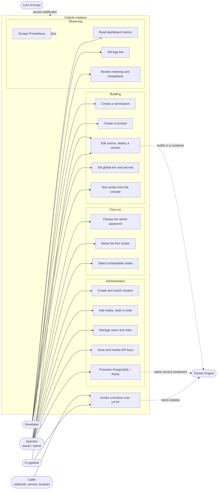

**Roles** gate the administration column. `readonly` < `developer` < `admin` <
`owner`; deleting a cluster or a user requires `owner`, provisioning a data
service requires `admin`, deploying requires `developer`.
See [`deps.py`](../services/api/cubicle/deps.py).

---

## 3. Deployment view

Containers, the networks that join them, and what crosses each boundary.

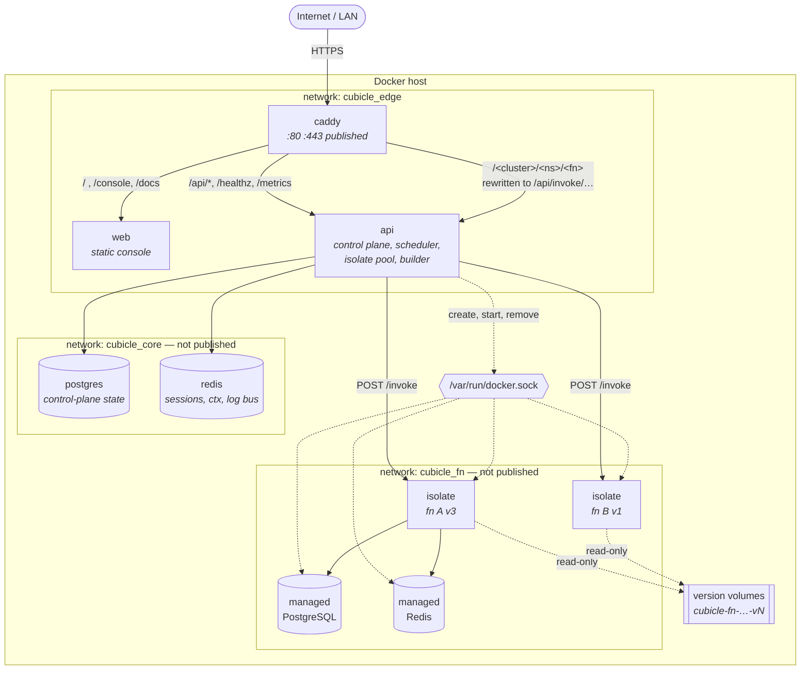

Notes that matter:

- **Only `caddy` is published.** Isolates and data services are reachable from
  the control plane and from each other, never from the host.
- **The `api` container holds the Docker socket.** That is how it starts
  isolates, and it is the instance's trust boundary — see
  [§12](#12-trust-boundaries).
- **Function code never travels on a shared filesystem.** Each version gets its
  own Docker volume, mounted read-only, so an isolate cannot see another
  function's source.

---

## 4. Data model

Everything durable lives in one PostgreSQL database.
See [`models.py`](../services/api/cubicle/models.py).

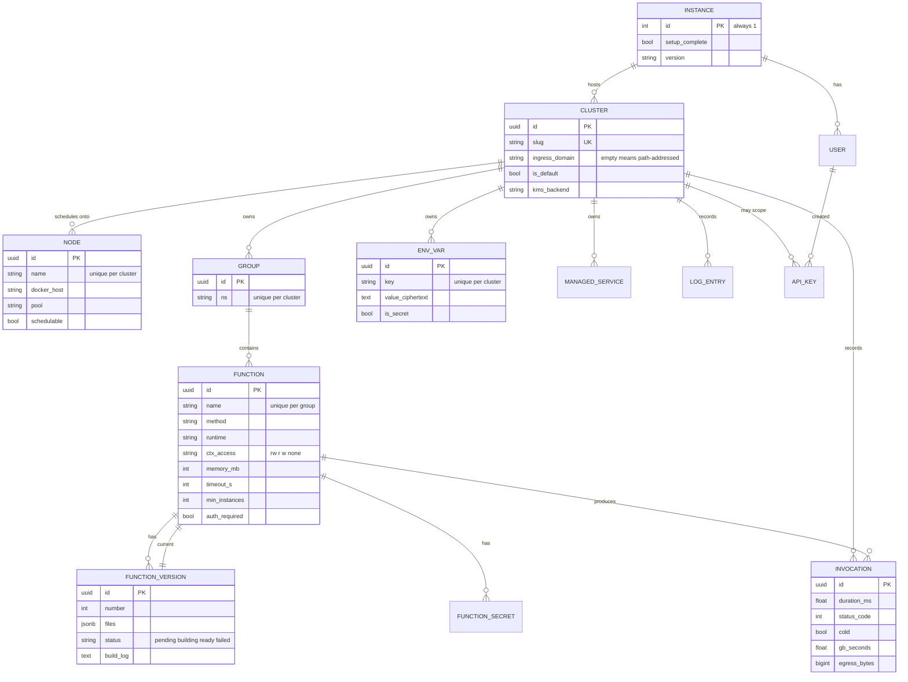

Two constraints carry a lot of weight:

- `ns` is unique **per cluster**, not globally. Two clusters may both own
  `payments`.
- `FUNCTION.current_version_id` is what serves traffic. Building a new version
  does not touch it until the build succeeds — that is the atomic swap.

---

## 5. Sequence — first-run setup

There is no registration. The first person to open the console creates the only
account. See [`routers/setup.py`](../services/api/cubicle/routers/setup.py).

```mermaid
sequenceDiagram
    autonumber
    actor Op as Operator
    participant Web as Console
    participant API as Control plane
    participant PG as PostgreSQL
    participant RD as Redis
    participant DK as Docker Engine

    Op->>Web: open the instance
    Web->>API: GET /api/setup/status
    API-->>Web: setup_complete = false
    Web-->>Op: show the wizard

    Web->>API: GET /api/setup/nodes
    API->>DK: engine info
    DK-->>API: CPUs, memory, arch, version
    API-->>Web: the engine it can already see

    Op->>Web: name, email, password, cluster, nodes
    Web->>API: POST /api/setup

    API->>API: check password policy
    Note over API: argon2id hash — the plaintext<br/>is never stored or logged

    rect rgb(24,28,20)
        Note over API,PG: step 1 — credentials
        API->>PG: INSERT user (owner)
        API->>PG: INSERT api_key (first CLI token)
    end

    rect rgb(24,28,20)
        Note over API,PG: step 2 — the first cluster
        API->>PG: INSERT cluster (is_default = true)
        API->>PG: UPDATE instance SET setup_complete = true
    end

    API->>RD: create session
    API-->>Web: Set-Cookie + the CLI token, shown once
    Note over API: the rest runs in the background<br/>while the wizard animates

    par background provisioning
        API->>DK: register the local engine as node-01
        API->>PG: INSERT node
        API->>RD: progress: nodes done
        API->>DK: ensure the cubicle_fn network
        API->>RD: progress: ingress done
        API->>DK: are the runtime images present?
        API->>RD: progress: runtimes done
    and the wizard watches
        Web->>API: GET /api/setup/progress (SSE)
        API-->>Web: step events until complete
    end

    Web-->>Op: cluster ready — open the console
```

If a runtime image is missing the step is marked **failed** rather than silently
skipped, because nothing will deploy without it.

---

## 6. Sequence — deploying a function

A deploy produces an immutable version. The running version keeps serving until
the new one is proven good.
See [`runtime/builder.py`](../services/api/cubicle/runtime/builder.py) and
[`routers/functions.py`](../services/api/cubicle/routers/functions.py).

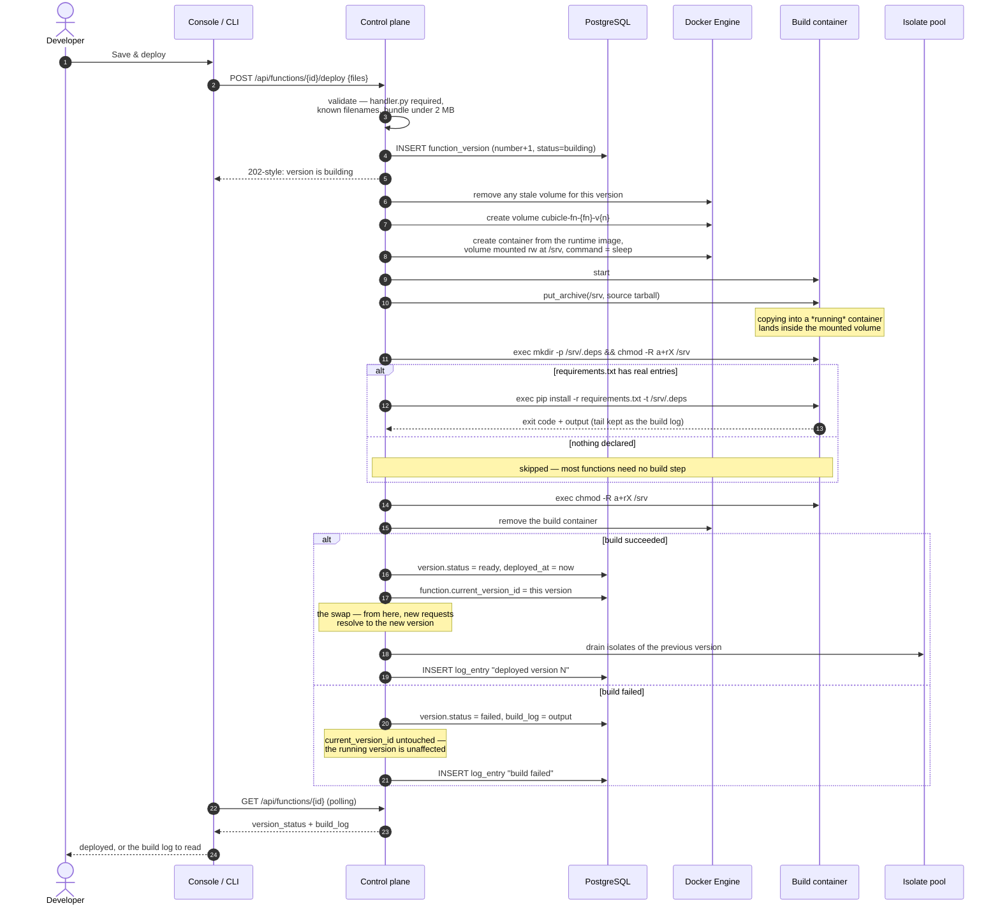

**Why a volume and not a bind mount.** The volume is created on the node that
will run the function, so this works identically for the local engine and for a
remote one over TCP. Nothing depends on a shared host path.

---

## 7. Sequence — invoking a function

### 7a. Cold start

No warm isolate exists, so one is created. Measured at ~400 ms on a 2-core
machine.

```mermaid
sequenceDiagram
    autonumber
    actor C as Caller
    participant CA as Caddy
    participant API as Control plane
    participant PG as PostgreSQL
    participant RD as Redis
    participant DK as Docker Engine
    participant IS as Isolate agent

    C->>CA: POST /prod-cluster/payments/create-charge
    CA->>API: rewritten to /api/invoke/…

    API->>PG: resolve cluster, namespace, function
    API->>API: guards — paused? method? auth? version ready?
    API->>PG: read the current version

    API->>RD: read session context for this namespace
    API->>PG: read env vars + function secrets
    Note over API: decrypted in memory only

    API->>API: pool.acquire — no idle isolate, room to grow

    rect rgb(32,26,20)
        Note over API,IS: cold start
        API->>DK: run container<br/>image = runtime, volume ro at /srv,<br/>mem/cpu capped, read-only rootfs,<br/>caps dropped, user 65532
        DK-->>API: container id + IP on cubicle_fn
        loop until ready, 30 s budget
            API->>IS: GET /healthz
            IS-->>API: ready = false (still importing)
        end
        Note over IS: import handler.py once,<br/>keep the callable in memory
        IS-->>API: ready = true
    end

    API->>IS: POST /invoke {event, env, secrets, ctx, service URLs}
    IS->>IS: run handler on a worker thread
    IS-->>API: {status_code, body, logs, context_writes}

    API->>RD: merge context writes, append the write log
    API->>API: release the isolate back to the pool
    API-->>CA: response + X-Cubicle-Cold-Start: 1
    CA-->>C: response

    par recorded out of band
        API->>PG: INSERT invocation (duration, gb_seconds, egress)
        API->>PG: INSERT log entries
        API->>RD: PUBLISH to the live log channel
    end
```

### 7b. Warm

The same request when an isolate already exists — 2–5 ms of platform overhead.

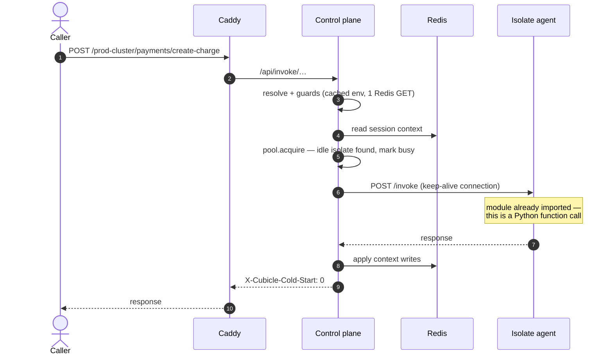

The whole difference is the boxed section in 7a. Nothing is spawned per
invocation in either path.

---

## 8. Activity — the request pipeline

Every decision an invocation passes through, in order.
See [`routers/invoke.py`](../services/api/cubicle/routers/invoke.py).

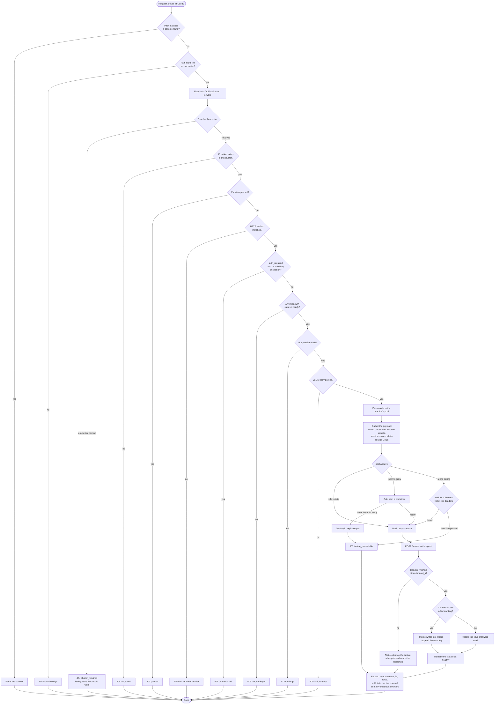

**Metering is honest about failures.** A 502 or 503 never reached the handler,
so it is recorded but charged `0` GB-seconds — billing a customer for a platform
failure would make the metering page a lie.
See [`runtime/invoker.py`](../services/api/cubicle/runtime/invoker.py).

---

## 9. Activity — isolate lifecycle

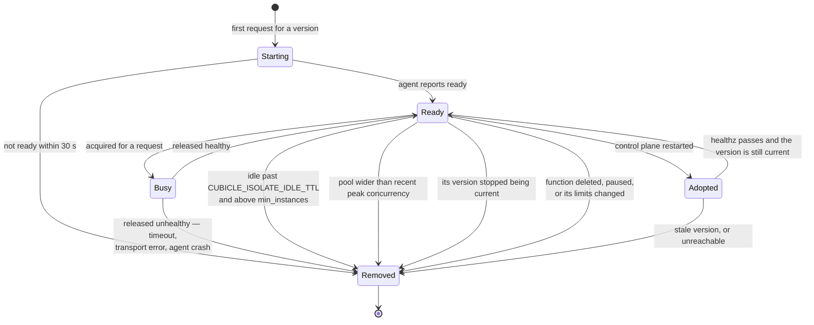

Four properties fall out of this:

- **Scale to zero, in two stages.** The reconcile loop runs every 30 s. Once a
  function has been quiet for `CUBICLE_ISOLATE_SCALEDOWN_WINDOW` (60 s) it gives
  back the isolates a burst created, one per pass; the last one goes when it has
  been idle for `CUBICLE_ISOLATE_IDLE_TTL` (900 s), and the function then costs
  nothing but a database row. Verified: a 20-request burst against a cap of 6
  went 6 → 1 in 2.5 minutes.
- **Restarts stay warm.** Shutdown deliberately leaves isolates running; on the
  way back up `adopt` re-attaches to the ones whose version is still current and
  removes the rest. Verified: a request straight after a control-plane restart
  returned `X-Cubicle-Cold-Start: 0`.
- **Concurrency is isolates, not threads.** The control plane marks an isolate
  busy and will not give it a second request; parallelism comes from starting
  more of them, up to the function's own **max instances** (default 4) and never
  past the instance-wide `CUBICLE_ISOLATE_MAX_PER_FUNCTION` (8). At the ceiling a
  request waits for a free isolate rather than starting another container, which
  is what stops one busy function from taking a whole node. Verified: with the
  cap at 2, twenty-four concurrent requests ran on exactly two isolates.
- **Work is spread, not stacked.** `acquire` takes the *least-used* idle
  isolate, so traffic converges on an even split rather than piling onto
  whichever one happens to be first in the list — 60 sequential requests across
  five isolates landed 21/21/22/22/21. Spreading load keeps every isolate's
  last-used timestamp fresh, so idle-TTL alone would never shrink a pool that
  grew during a burst; the reconcile loop also trims one isolate per pass while
  the pool is wider than the concurrency seen in the last scale-down window.

---

## 10. Activity — finding the cluster

Every endpoint names its cluster. There is no unqualified form, because if the
default cluster answered a bare path, promoting a different default would
quietly change what an existing URL addressed.
See [`clusters.py`](../services/api/cubicle/clusters.py).

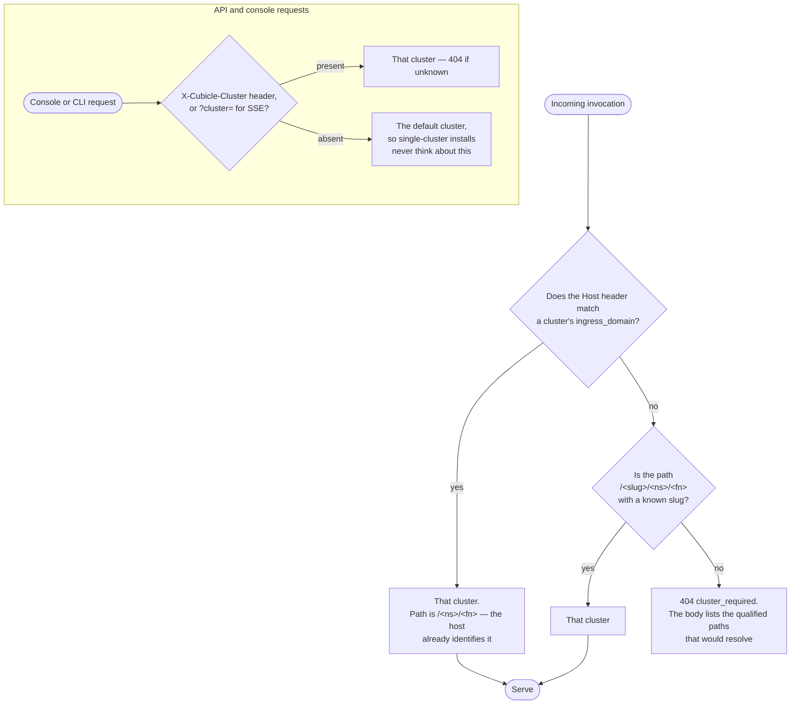

---

## 11. The reconcile loop

One background task in the control plane, every
`CUBICLE_RECONCILE_INTERVAL` (30 s).
See [`main.py`](../services/api/cubicle/main.py).

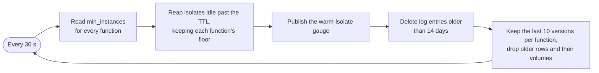

The loop swallows its own exceptions and keeps running — a transient Docker
error must not stop reaping forever.

---

## 12. Trust boundaries

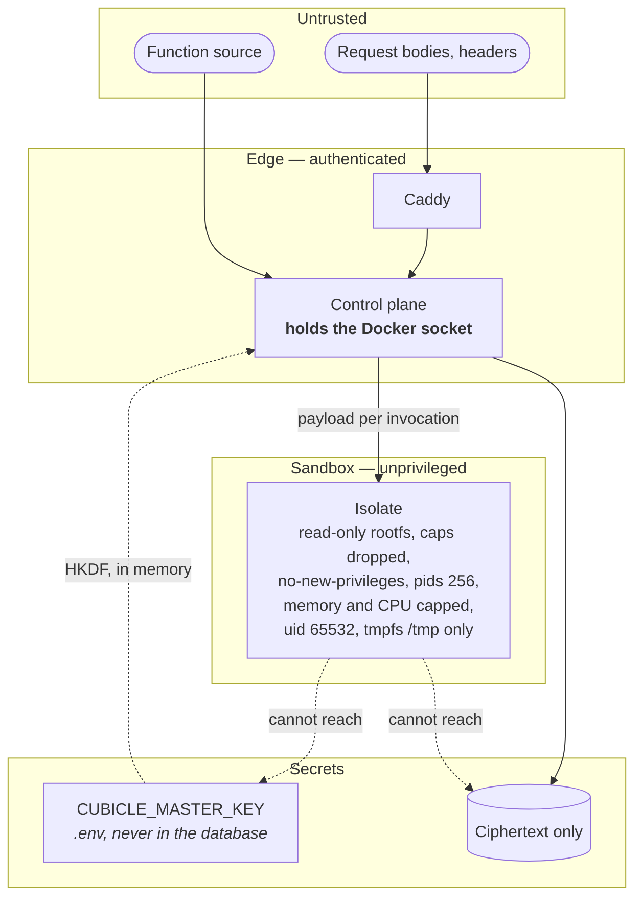

What this buys, and what it does not:

- **Secrets at rest.** Each secret gets its own AES-256-GCM data key, wrapped by
  a key derived from `CUBICLE_MASTER_KEY` via HKDF. The database holds only
  sealed material, bound to its record — a ciphertext moved to another key will
  not decrypt. Values reach an isolate in the invocation payload and are never
  written to its filesystem or the log pipeline.
  See [`crypto.py`](../services/api/cubicle/crypto.py).
- **Isolate containment.** Unprivileged user, read-only root filesystem, all
  capabilities dropped, `no-new-privileges`, a pids limit, memory and swap
  capped equal, CPU scaled to the memory setting, and a 64 MB tmpfs as the only
  writable path.
- **The honest caveat.** Containers are not a hard multi-tenant boundary. If you
  run genuinely untrusted third-party code, put clusters on separate hosts.
- **The Docker socket is the crown jewel.** The `api` container can create
  containers on the host, which is equivalent to root there. Treat access to it
  accordingly, and do not expose the API to an untrusted network without the
  edge in front of it.

---

## 13. Failure modes

| What happens | What the platform does | What you see |
| --- | --- | --- |
| Build fails (bad `requirements.txt`) | New version marked `failed`; `current_version_id` untouched | Running version keeps serving; the build log is on the function |
| Handler raises | Traceback captured into the log pipeline | `500` with the exception message; the isolate stays warm |
| Handler exceeds `timeout_s` | Agent returns `504`; control plane destroys the isolate | `504`; next request cold-starts |
| Isolate never becomes ready | Container removed, its output logged | `503 isolate_unavailable`; not metered |
| All 8 isolates busy | Waits for one to free within the deadline | `503` only if the deadline passes |
| Control plane restarts | Isolates left running, then adopted | Requests stay warm across the restart |
| Docker engine unreachable | Node marked `down`; `/healthz` reports `docker: false` | Console loads and explains, rather than erroring blankly |
| Node drained | Removed from scheduling; existing isolates keep serving | New isolates land elsewhere |
| `CUBICLE_MASTER_KEY` changed or lost | Every secret becomes undecryptable | Explicit "root key changed" in place of the value — by design |
| A data service container predates a change to how they are created | **Recreate** rebuilds it from the current spec, reusing the volume and the stored password | A restart; the data, credentials and connection string are unchanged |

---

## 14. Where things live

```
services/api/cubicle/
  main.py              app wiring, health, /metrics, reconcile loop
  clusters.py          cluster resolution and URL construction
  deps.py              auth, roles, the active-cluster dependency
  crypto.py            envelope encryption
  security.py          argon2 passwords, Redis sessions, API keys
  models.py            the whole schema
  analytics.py         every aggregate the console shows
  pricing.py           the hosted-cost comparison
  templates.py         what a new function is scaffolded with
  runtime/
    engine.py          Docker clients, one per node
    builder.py         deploy-time build into a version volume
    pool.py            isolate lifecycle, acquire/release, adoption
    invoker.py         the invocation path and its recording
    nodes.py           node registry and scheduling
    services.py        managed PostgreSQL and Redis
  routers/             one module per surface

services/runtime/
  agent.py             the in-isolate HTTP agent (standard library only)
  sdk/cubicle_context  Request, Context, env
  sdk/cubicle_db       postgres, redis

services/web/src/      the console
cli/                   the cubicle command
deploy/caddy/          edge configuration
```

---

**Related reading.** [README](../README.md) for installing and operating an
instance; the console's own **Docs** section for writing functions, secrets,
`cubicle.toml` and the CLI.
